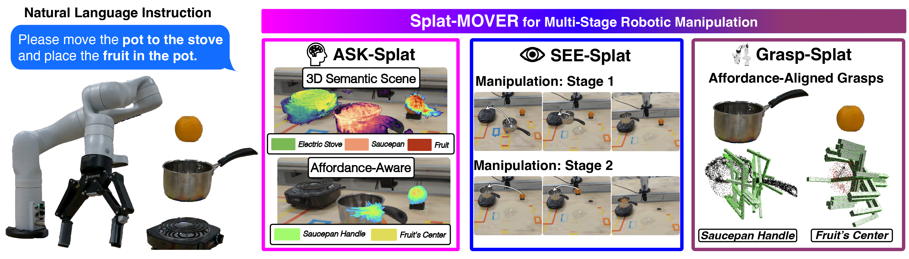

<p align="center">

  <h1 align="center"> Splat-MOVER: Multi-Stage, Open-Vocabulary Robotic Manipulation via Editable Gaussian Splatting</h1>
  <p align="center"> 
    <span class="author-block">
        <a href="/">Ola Shorinwa</a><sup>&#42;</sup>,</span>
    <span class="author-block">
        <a href="https://scholar.google.com/citations?user=D1OiGH8AAAAJ&hl=en">Johnathan Tucker</a><sup>&#42;</sup>,</span>
    <span class="author-block">
        <a href="/">Aliyah Smith</a>,
    </span>
    <span class="author-block">
        <a href="https://scholar.google.com/citations?hl=en&user=feH32sgAAAAJ">Aiden Swann</a>,
    </span>
    <span class="author-block">
        <a href="https://scholar.google.com/citations?hl=en&user=u9ZQdTwAAAAJ">Timothy Chen</a>,
    </span>
    <span class="author-block">
        <a href="https://scholar.google.com/citations?hl=en&user=ZfxUwNEAAAAJ">Roya Firoozi</a>,
    </span>
    <span class="author-block">
        <a href="https://scholar.google.com/citations?hl=en&user=x2ZPRfoAAAAJ">Monroe Kennedy III</a>,
    </span>
    <span class="author-block">
        <a href="https://scholar.google.com/citations?hl=en&user=-EqbTXoAAAAJ">Mac Schwager</a>
    </span>
  </p>
  <p align="center"><strong>Stanford University</strong></p>
  <p align="center"><strong><sup>&#42;</sup>Equal Contribution.</strong></p>
  
  <h3 align="center"><a href="https://splatmover.github.io/"> Project Page</a> | <a href= "https://arxiv.org/abs/2405.04378">arXiv</a> </h3>
  <div align="center"></div>
</p>
<p align="center">
  <a href="">
    
  </a>
</p>

## Splat-MOVER
We present Splat-MOVER, a modular robotics stack for open-vocabulary robotic manipulation,which leverages the editability of Gaussian Splatting (GSplat) scene representations to enable multi-stage manipulation tasks. Splat-MOVER consists of: (i) ASK-Splat, a GSplat representation that distills semantic and grasp affordance features into the 3D scene. ASK-Splat enables geometric, semantic, and affordance understanding of 3D scenes, which is critical for many robotics tasks; (ii) SEE-Splat, a real-time scene-editing module using 3D semantic masking and infilling to visualize the motions of objects that result from robot interactions in the real-world. SEE-Splat creates a “digital twin” of the evolving environment throughout the manipulation task; and (iii) Grasp-Splat, a grasp generation module that uses ASK-Splat and SEE-Splat to propose affordance-aligned candidate grasps for open-world objects.

## Installation
This repository utilizes [Nerfstudio](https://docs.nerf.studio/quickstart/installation.html), [GraspNet](https://github.com/graspnet/graspnet-baseline), and [VRB](https://github.com/shikharbahl/vrb).
Please install these packages from source, then proceed with the following steps:

1. Clone this repo.
```
git clone git@github.com:StanfordMSL/Splat-MOVER.git
```

2. Install `sagesplat` as a Python package.
```
python -m pip install -e .
```

3. Register `sagesplat` with Nerfstudio.
```
ns-install-cli
```

Now, you can run `sagesplat` like other models in Nerfstudio using: 
```
ns-train sagesplat --data <path to the data directory for a given scene>
```
You can try out the data used in the experiments [here](https://drive.google.com/drive/folders/1rMsVu8iJ4sm1TCf52bX_gTJOGPKmAlfJ?usp=sharing).
